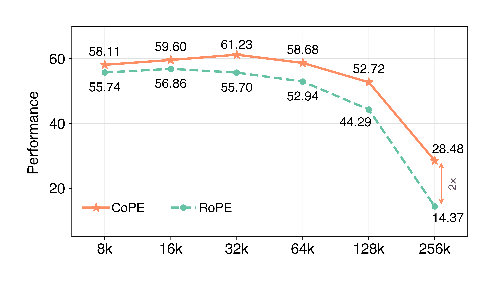
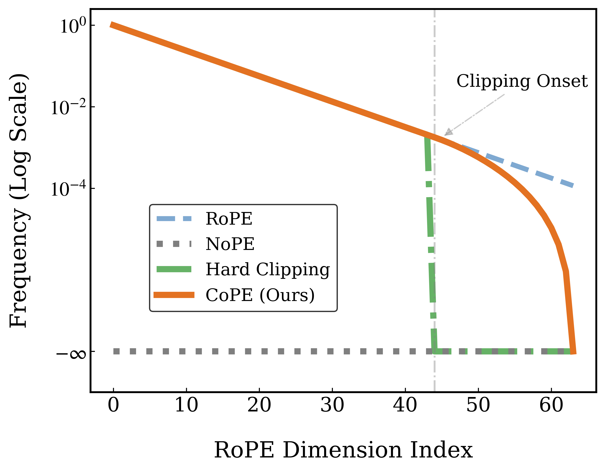

<h2 align="center" style="font-size: 30px;">CoPE: Clipped RoPE as A Scalable Free Lunch for Long Context LLMs</h2>

<h5 align="center">
  
[](https://arxiv.org/abs/2602.05258)
[](https://huggingface.co/collections/haoranli-ml/cope)

</h5>


## 📢 News
- **\[02/05/2026\]** **CoPE** was released on [arXiv](https://arxiv.org/abs/2602.05258)!


## ✨  Overview

**CoPE** is a plug-and-play enchancement of RoPE that *softly* clips the unstable low-frequency components, delivering consistent gains both **within the training context** and during **long-context extrapoaltion**.

<div align="center">
  
  
</div>


With a simple yet effective soft clipping strategy, CoPE

1️⃣ **Eliminates severe OOD outliers**, whose periods exceed the pre-training context window and are the primary cause of OOD extrapolation.

2️⃣ **Refines Long-range Semantic Signals** by alleviating the secret *long-term decay of semantic attention* introduced by RoPE.

3️⃣ **Prevents Spectral Leakage** induced by hard frequency truncation, which otherwise leads to long-range oscillatory ringing in the attention scores across relative token distances and introduces spurious correlations.


## ⚡ Download the Models and Data

All our models and data are released on Hugging Face, including **RoPE, HardClip, and CoPE** checkpoints (64k) obtained via continued pre-training and SFT, starting from Llama-3-8B (8k). [[Link]](https://huggingface.co/collections/haoranli-ml/cope)


## 🚀 Training

Our training code is based on [ProLong](https://github.com/princeton-nlp/ProLong). And we recommend having two seperate environments for training and evaluation to avoid dependency conflicts.

1. Setup training environment.
```
cd train/
conda create -n cope_train python=3.10
bash setup_env.sh
```

2. Download training data.
```
git clone https://huggingface.co/datasets/haoranli-ml/prolong-data-64K datasets/long-context-65536
git clone https://huggingface.co/datasets/haoranli-ml/prolong-ultrachat-64K datasets/prolong-ultrachat-64K
```

3. Start training.
```
bash train_64k.sh
bash train_sft.sh
```
We note that the default method in training is CoPE, while you can easily switch to HardClip or vanilla RoPE by modifying `CoPE/train/training/modeling_flash_llama_cope.py`.


## 🔍 Evaluation

We primarily conduct evaluations on the [HELMET](https://github.com/princeton-nlp/HELMET) benchmark given its diverse collection of real-world tasks, while also including results on synthetic benchmarks such as [RULER](https://github.com/NVIDIA/RULER) and [InfiniteBench](https://github.com/OpenBMB/InfiniteBench). For standard short-context benchmark evaluations, we utilze [lm-evaluation-harness](https://github.com/EleutherAI/lm-evaluation-harness).

1. Setup Eval Environment
```
# install `transformers==4.50.0` from source
cd CoPE
wget https://github.com/huggingface/transformers/archive/refs/tags/v4.50.0.tar.gz
tar -xzf v4.50.0.tar.gz
```

2. Replace the code in
```
CoPE/transformers-4.50.0/src/transformers/models/llama/modeling_llama.py
```
with `CoPE/modeling_cope.py`. And rename it back to `modeling_llama.py`. Note that you have to modify the 


## 📖 Citation
```
@article{li2025cope,
  title={CoPE: Clipped RoPE as A Scalable Free Lunch for Long Context LLMs},
  author={Li, Haoran and Ren, Sucheng and Yuille, Alan and Wang, Feng},
  journal={arXiv preprint arXiv:2602.05258},
  year={2026}
}
``` 
